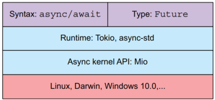

### install rustup ###
```
curl --proto '=https' --tlsv1.2 -sSf https://sh.rustup.rs | sh
```
    rustup update
    rustup defalt stable
* Use toolchain config: **rust-toolchain.toml**
```
[toolchain]
channel = "stable"
components = ["rustfmt", "clippy"]
targets = ["x86_64-unknown-linux-gnu"]
```
* **Ubuntu sytem package manager** is using ***sudo apt*** to **install**, **update**, **remove** etc.

### Setup VSC Remote SSH
- Install Remote SSH plugin
- After installation, re-start VSC, and click left-bottom (SSH)
- Choose **Connect to Host**
- Enter to be connected host name or IP, it will ask for password if everything goes well
- Configure your SSH config if you want to use public key using ~/.ssh/config
```
  Host <A-name>
    HostName <host-name>
    User <username>
    IdentityFile ~/.ssh/id_rsa
```

### String vs. &str ###
* Underneath the String is vector, that means we can remove and insert u8 values to the vector 
* A &str (string literal) 
    * is a representation of u8 values(text), which we cannot modify, can be seen as a fixed-size window to an underlying string of characters.
    * when dealling with &str, we deal with the pointer to the space in memory, and we are allowed to read but not modify it, this makes &str more memory efficient
    * i.e, when create function and want to just read the value, use **&str**, if you want to own and modify it, use **String**
* Fat pointer ~ memory address and length field
* String pointer ~ memory addresss, length field, and capacity field
* str ~ an immutable sequence of UTF-8 bytes, that does not have a fixed length.its length is dynamic, and size unknown, we can only handle it behind a pointer, and str most commonly appears as &str
* Passing a variable to a function hands over the ownership of the underlying data to the function

### Ingredients of an asynchronous programming ###
- Use of the kernel's asynchronous read-and-write API through epoll/select/poll
- Capability to offload long-running tasks in the user space and have a mechanism to notify us when the task is done so we can progress, this is a runtinme creating and managing the **Green Threads**
- A syntax within the programming language
- A specific type in the STD Libfor mutually exclusive acdess and modification.

**Rust comes without a runtime or an abstraction over
asynchronous kernel APIs.**



* A function that you await returns a Future
type, which has the type of value you return in case of a successful execution, and a
method called poll that executes the long-running process and yields back Pending or Ready. The Ready state can then either have an Error or a successful return value.

#### Waht await tells Rust runtime ####
* In Rust, when you use `.await` on a future (like an async function call), you are telling the async runtime (such as Tokio or async-std):

- **"Pause this function here until the awaited operation completes."**
- **"While waiting, let other tasks run."**

The runtime will:
- Suspend the current async task at the `.await` point.
- Schedule other tasks or I/O while waiting.
- Resume your function when the awaited operation is ready.

This allows efficient, non-blocking concurrency.

### Setup Rustup/Cargo in restricted environment ###
* download binary for specific environment, for example an virtual machine
* copy and unzip it to a directory, then inside the director, using sudo ./install.sh to install it
* To make cargo to download dependencies, 
 * add proxy to ~/.cargo/config.toml
   [http]
   proxy="your-proxy:port"
 * first get a certificate of organization, and put it to a directory, named as cacert.pem, for example
 * then using browser or other tools to get index.crate.io certificate and append it to the  cacert.pem 
 * get other certificates if required do the same as above
* then you should be able to use cargo to build

#### Async/Await ####
* The intent of the syntax **async** and **await** is to make wrting asynchronous Rust code feel like synchronous, blocking code to the programmer. In the background, Rust is transforming this piece of code into a state machine, where each different **await** represents a state. Once all of the states are ready, the function continues to the last line and returns the result.


### Ownership
* Whenever we pass a value to a new function, we transfer the ownership of this value and have to wait until we get it back.

### Rc and Arc
* **Rc** -  works only on single-threaded systems.
* **Arc** - *(atomically reference count)* is for multithreaded, enabling you to share data among multiple threads
  * It is like a container, which moves the wrapped data onto the ***heap*** and creates a pointer toit on the ***stack***
  * When cloneing an **Arc**, you cone the pointer that points to the same data structure on the ***heap***, count increased by 1

### Mutex and RwLock
* Mutex blocks for either a writer or reader
* RwLock allows many readers simultaneously but just ***one writer at a time***
